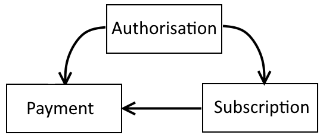

# Asperato ONE Salesforce package

The core package consists of three custom objects and a set of web services that communicate between Asperato and Salesforce.  The web services are all managed through Apex classes.  The package is designed to be extensible so that the package web service classes can be replaced by custom Apex code if that is required.  

There are simple VisualForce pages to support each of the data objects and tabs accessing these are grouped together into an Asperato application.

The configuration of the package is managed via Custom Metadata.  There are two Metadata Types, Asperato Settings and Service Handler.  The options available for these settings are described below.

Note that this package is available for: Lightning Enterprise & Lightning Unlimited only.  For further information please see <https://www.salesforce.com/uk/editions-pricing/sales-cloud/>


## Design overview


### The web journey

The web journey is where a payment or an authorisation is set up via screens that require interaction from a paying person.  This is typically through links in a website, links sent in email communications or direct from Salesforce via a button or a link.

The journey starts with a URL that invokes an Asperato program.  The URL will contain at least one parameter (`pmRef`) and might have several more.  This are described more fully elsewhere.  The parameters are used to:<br/>
  * Obtain configuration from Asperato using the `pmRef` parameter.<br/>
  * Obtain data from Salesforce using either the GetAuthorisations REST webservice or the GetPayments REST webservice.  The requests and responses for these services are described fully elsewhere in this documentation.
  
The Asperato program combines the configuration and the data to create a dynamic web screen that is then displayed to the person making the payment in a web browser.<br/>
The payer then enters data to the web screen and control then passes to another Asperato program.<br/>
This second program accepts and validates the data input and then calls the relevant payment gateway.<br/>
The gateway then returns a response and this is passed back to Salesforce using either or both of the REST webservices PutAuthorisations and PutPayments.<br/>
Asperato then displays the outcome of the whole transaction on either a success or a fail screen.

### The automatic (repeat) payment journey

The automatic payment journey is the process by which a payment can be taken without the need for screen input on behalf of the payer based on an authorisation that has already been put in place.  This authorisation is typically a Direct Debit mandate or a card continuous payment authority.<br/>

The journey starts in Salesforce where suitable code creates a list of payments that are due for collection.  <br/>
This list of payments is then sent to Asperato using a REST web service.<br/>
Asperato then applies validation to each line in the list and either accepts or rejects the individual request line.<br/>
For those lines that are accepted Asperato calls the relevant gateway. <br/>
The gateway then returns a response and this is passed back to Salesforce using either or both of the REST webservices PutAuthorisations and PutPayments.<br/>


### Terminology 

In Asperato terms an Authorisation is a record of an authority given by a payer to collect automatic payments.  This will take the physical form of either a Direct Debit mandate or a card Continuous Payment Authorisation (CPA).  Creating an authority does not take money from the associated account, it merely sets up the mechanism to allow that to happen in the future.  There are rules in force about what you have to tell the payer when you set up an authority and when you take payments using it.  Those rules vary depending on the payment route you are using.

A Payment is a financial transaction.  This can include a refund. Its key attributes are that is has an amount, currency, a due date and a payment route.

In Asperato terms an Automatic or Repeat payment is defined as where:<br/>
The payment frequency is not ‘Single’.<br/>
The payment frequency is ‘Single’ but the payment due date is in the future.<br/>
The payment route is either BACS or SEPA since these require authorisations even for one off payments


#### Payment scenarios

Basic actions on the data in Salesforce:<br/>
(a) Create new `Authorisation` row<br/>
(b) Update existing `Authorisation` row<br/>
(c) Create a new `Paymen`t row<br/>
(d) Update an existing `Payment` row<br/>

These are the data scenarios that the package is designed to deal with:
<table>
  <tr>
    <th>Scenario</th>
    <th>Action</th>
  </tr>
  <tr>
    <td>New authority where no data currently exists</td>
    <td>(a)</td>
  </tr>
  <tr>
    <td>New authority where an `Authorisation` row already exists</td>
    <td>(b)</td>
  </tr>
  <tr>
    <td>Update to an existing authority</td>
    <td>(b)</td>
  </tr>
  <tr>
    <td>Single payment where no data currently exists</td>
    <td>(c)</td>
  </tr>
  <tr>
    <td>Single payment where a `Payment` row already exists</td>
    <td>(d)</td>
  </tr>
  <tr>
    <td>Repeat payment where where no data currently exists on either `Authorisation` or `Payment`</td>
    <td>(a) + (c)</td>
  </tr>
  <tr>
    <td>Repeat payment where where no data currently exists on `Payment` but an `Authorisation` row exists</td>
    <td>(b) + (c)</td>
  </tr>
  <tr>
    <td>Repeat payment where where data exists on `Payment` but no related `Authorisation` row exists</td>
    <td>(a) + (d)</td>
  </tr>
  <tr>
    <td>Repeat payment where where rows exist on both `Authorisation` and `Payment`</td>
    <td>(b) + (d)</td>
  </tr>
  <tr>
    <td>Subsequent repeat payment (i.e. an automatic payment)</td>
    <td>(b) + (d)</td>
  </tr>
</table>


## The data objects

The package data objects are called `Payment`, `Subscription` and `Authorisation` and they are related to each other as per the diagram below.




### Authorisation

Authorisation contains data relating to an authority to collect payments.  This can take the form of either a Direct Debit mandate or a card continuous payment authority.

The fields and their usage are described below:	

<table>
  <tr>
    <th>Field</th>
    <th>Usage</th>
  </tr>
  <tr>
    <td>Account Name</td>
    <td>Records the name on the bank account or the cardholder name for future reference.</td>
  </tr>
  <tr>
    <td>Account Reference</td>
    <td>A partially obscured record of the bank account or credit card number for future reference.</td>
  </tr>
  <tr>
    <td>Billing Address City</td>
    <td>Records the city in the billing address that was captured on the payment page.</td>
  </tr>
  <tr>
    <td>Billing Address Country</td>
    <td>Records the country in the billing address that was captured on the payment page.</td>
  </tr>
  <tr>
    <td>Billing Address PostalCode</td>
    <td>Records the postal code in the billing address that was captured on the payment page.</td>
  </tr>
  <tr>
    <td>Billing Address State</td>
    <td>Records the state/county in the billing address that was captured on the payment page.</td>
  </tr>
  <tr>
    <td>Billing Address Street</td>
    <td>Records the street(s) in the billing address that was captured on the payment page.</td>
  </tr>
  <tr>
    <td>Card Type</td>
    <td>The type of credit or debit card, or `Not Applicable` for the other Authorisation Types.</td>
  </tr>
  <tr>
    <td>Company Name</td>
    <td>Records the company name that was captured on the payment page.</td>
  </tr>
  <tr>
    <td>CPA Granted</td>
    <td>Indicates that the customer has given permission for card details to be used to collect automatic payments.</td>
  </tr>
  <tr>
    <td>Email</td>
    <td>Records the email address that was captured on the payment page.</td>
  </tr>
  <tr>
    <td>Expiry Date</td>
    <td>The date on the which the authorisation will expire (if applicable).</td>
  </tr>
  <tr>
    <td>First Name</td>
    <td>Records the first name that was captured on the payment page.</td>
  </tr>
  <tr>
    <td>Last Name</td>
    <td>Records the last name that was captured on the payment page.</td>
  </tr>
  <tr>
    <td>Mandate Reference</td>
    <td>The reference for a Direct Debit mandate that will need to be displayed to the end customer in emails and other communication.</td>
  </tr>
  <tr>
    <td>Payment Route</td>
    <td>One of:
      <ul>
        <li><b>Card</b> Credit or debit card</li>
        <li><b>BACS</b> UK Direct Debit</li>
        <li><b>eCheck</b>	US Bank payment</li>
        <li><b>SEPA</b> European Direct Debit</li>
        <li><b>Wallet</b> PayPal, etc.</li>
      </ul>
    </td>
  </tr>
  <tr>
    <td>Repeat Cross Reference</td>
    <td>One of a pair of fields needed to make a repeat payment request.</td>
  </tr>
  <tr>
    <td>Repeat Order ID</td>
    <td>One of a pair of fields needed to make a repeat payment request.</td>
  </tr>
  <tr>
    <td>Status</td>
    <td>The status of the authorisation.  Can be one of:
      <ul>
        <li><b>Pending</b> Has been created but is not yet active</li>
        <li><b>In Force</b> In force and ready to use</li>
        <li><b>Cancelled</b> Has been stopped</li>
        <li><b>Failed</b> Has failed for some reason</li>
      </ul>
    </td>
  </tr>
  <tr>
    <td>Status Description</td>
    <td>A descriptive text showing the reason related to the current status.  Might contain the reason for cancellation or failure for example.</td>
  </tr>
</table>


### Payment Schedule

Payment Schedule contains the information needed to drive the creation of payments where they need to recur automatically.

Payment Schedule has a lookup relationship with Authorisation.

The fields are their usage are described below:	

<table>
  <tr>
    <th>Field</th>
    <th>Usage</th>
  </tr>
  <tr>
    <td>Authorisation</td>
    <td>A link to the related Authorisation object.  A subscription must have and entry here in order to process a payment.</td>
  </tr>
  <tr>
    <td>Authorisation Status</td>
    <td>A formula reflecting the status of the associated Authorisation.</td>
  </tr>
  <tr>
    <td>Day of the Month</td>
    <td>The day of the month on which the subscription payment should be taken.</td>
  </tr>
  <tr>
    <td>Frequency</td>
    <td>The payment frequency for the subscription. One of:
      <ul>
        <li><b>Daily</b></li>
        <li><b>Weekly</b></li>
        <li><b>Monthly</b></li>
        <li><b>Quarterly</b></li>
        <li><b>Semi-annual</b></li>
        <li><b>Annual</b></li>
      </ul>
    </td>
  </tr>
  <tr>
    <td>Last Payment Date</td>
    <td>The date on which the subscription payment request was last raised.</td>
  </tr>
  <tr>
    <td>Next Payment Date</td>
    <td>The date on which the next payment request will be raised.</td>
  </tr>
  <tr>
    <td>Payment Route</td>
    <td>A formula reflecting the payment route of the associated Authorisation.</td>
  </tr>
  <tr>
    <td>Regular Amount</td>
    <td>The amount of the subscription charge.  The currency will be determined based on the currency of the Subscription record in a multi-currency org or from the org default currency for a single currency org.</td>
  </tr>
  <tr>
    <td>Start Date</td>
    <td>Date of which the subscription come into force.</td>
  </tr>
  <tr>
    <td>Status</td>
    <td>The status of the subscription.  Can be one of:
      <ul>
        <li><b>In Force</b> In force and ready to use</li>
        <li><b>Cancelled</b> Has been stopped</li>
      </ul>
    </td>
  </tr>
  <tr>
    <td>Status Description</td>
    <td>A descriptive text showing the reason related to the current status.  Might contain the reason for cancellation for example.</td>
  </tr>
</table>


### Payment

Payment contains both the request for a payment to occur and also the response once it has been processed.

Payment has a lookup relationship to both Authorisation and Subscription.

The fields are their usage are described below:	

<table>
  <tr>
    <th>Field</th>
    <th>Usage</th>
  </tr>
  <tr>
    <td>Account Name</td>
    <td>Records the name on the bank account or the cardholder name for future reference.</td>
  </tr>
  <tr>
    <td>Account Reference</td>
    <td>A partially obscured record of the bank account or credit card number for future reference.</td>
  </tr>
  <tr>
    <td>Amount</td>
    <td>The amount of the payment.  Will contain either the requested amount of the amount actually collected depending on the status of the payment.</td>
  </tr>
  <tr>
    <td>Authorisation</td>
    <td>A link to the related Authorisation object if appropriate.</td>
  </tr>
  <tr>
    <td>Billing Address City</td>
    <td>Records the city in the billing address that was captured on the payment page.</td>
  </tr>
  <tr>
    <td>Billing Address Country</td>
    <td>Records the country in the billing address that was captured on the payment page.</td>
  </tr>
  <tr>
    <td>Billing Address PostalCode</td>
    <td>Records the postal code in the billing address that was captured on the payment page.</td>
  </tr>
  <tr>
    <td>Billing Address State</td>
    <td>Records the state/county in the billing address that was captured on the payment page.</td>
  </tr>
  <tr>
    <td>Billing Address Street</td>
    <td>Records the street(s) in the billing address that was captured on the payment page.</td>
  </tr>
  <tr>
    <td>Card Type</td>
    <td>The type of credit or debit card, or `Not Applicable` for the other Payment Types</td>
  </tr>
  <tr>
    <td>Company Name</td>
    <td>Records the company name that was captured on the payment page.</td>
  </tr>
  <tr>
    <td>Cross Reference</td>
    <td>A reference to the payment generated by the payment gateway.</td>
  </tr>
  <tr>
    <td>Email</td>
    <td>Records the email address that was captured on the payment page.</td>
  </tr>
  <tr>
    <td>First Name</td>
    <td>Records the first name that was captured on the payment page.</td>
  </tr>
  <tr>
    <td>Frequency</td>
    <td>A formula reflecting the payment frequency from the associated subscription if appropriate.</td>
  </tr>
  <tr>
    <td>Last Name</td>
    <td>Records the last name that was captured on the payment page.</td>
  </tr>
  <tr>
    <td>Order ID</td>
    <td>A unique reference to the payment transaction generated by Asperato and reflected through to the payment gateway.</td>
  </tr>
  <tr>
    <td>Original Payment</td>
    <td>A way of cross relating payments, for example where one transaction is a refund of another.</td>
  </tr>
  <tr>
    <td>Payment Date</td>
    <td>The date on which the payment was made.</td>
  </tr>
  <tr>
    <td>Payment Route</td>
    <td>One of:
      <ul>
        <li><b>Card</b> Credit or debit card</li>
        <li><b>BACS</b> UK Direct Debit</li>
        <li><b>eCheck</b> US Bank payment</li>
        <li><b>SEPA</b> European Direct Debit</li>
        <li><b>Wallet</b> PayPal, etc.</li>
      </ul>
    </td>
  </tr>
  <tr>
    <td>Repeat Cross Reference</td>
    <td>A formula reflecting the repeat cross reference from the associated authoriisation if appropriate.  Contains the text "Not set up yet" if there is no value.</td>
  </tr>
  <tr>
    <td>Repeat Order ID</td>
    <td>A formula reflecting the repeat order Id from the associated authoriisation if appropriate.  Contains the text "Not set up yet" if there is no value.</td>
  </tr>
  <tr>
    <td>Scheduled Date</td>
    <td>Date on which a payment is scheduled to be processed.  Can be used to set up payments that are due in the future.</td>
  </tr>
  <tr>
    <td>Sent Date</td>
    <td>Date on which an automatic payment was sent to Asperato for processing.</td>
  </tr>
  <tr>
    <td>Source</td>
    <td>Payment source.  Can be one of:
     <ul>
      <li><b>Web</b></li>
      <li><b>Holder not present</b></li>
      <li><b>Repeat</b></li>
     </ul>
    </td>
  </tr>
  <tr>
    <td>Status</td>
    <td>The status of the payment.  Can be one of:
      <ul>
        <li><b>Pending</b> Has been created but is not yet active</li>
        <li><b>Sent</b> Has been set to Asperato for processing.</li>
        <li><b>Paid</b> Has been paid.</li>
        <li><b>Refunded</b> Has been refunded.</li>
        <li><b>Failed</b> Has failed for some reason</li>
        <li><b>Payment Scheduled</b> Is ready for collection by the next batch run.</li>
      </ul>
    </td>
  </tr>
  <tr>
    <td>Status Description</td>
    <td>A descriptive text showing the reason related to the current status.  Might contain the reason for cancellation or failure for example.</td>
  </tr>
  <tr>
    <td>Subscription</td>
    <td>A link to the related Subscription record if appropriate.</td>
  </tr>
  <tr>
    <td>Type</td>
    <td>One of:
      <ul>
        <li><b>Payment</b></li>
        <li><b>Refund</b></li>
      </ul>
    </td>
  </tr>
</table>


## Installation

The core package is installed using a Salesforce package deployment link.  In the short term there are two versions on offer, one is an unmanaged package that contains the source and the other is a fully mananged package.  Be aware that if you install the unmanaged version then you would have to un-install it before you could then apply an upgrade.  The process of un-installation might be non-trivial, depending on the type of integration you have created.

For a sandbox organisation the install link is:<br/>
<https://test.salesforce.com/packaging/installPackage.apexp?p0=04t240000006VFG>
For a live or development organisation the install link is:<br/>
<https://login.salesforce.com/packaging/installPackage.apexp?p0=04t240000006VFG>

When installing make sure that the package is accessible by all Salesforce users (this is not the default).<br/>
Once the package has been installed you need to update the system Network Security so that the Asperato servers can communicate with your Salesforce organisation.
As a system administrator go to:<br/>
**Setup > Administer > Security Controls > Network Access**<br/>
Add the following Trusted IP Ranges:<br/>

> Start IP Address: 77.68.42.36<br/>
> End IP Address: 77.68.42.36<br/>
> Description: Asperato Test<br/>

> Start IP Address: 162.13.56.213<br/>
> End IP Address: 162.13.56.213<br/>
> Description: Asperato Live<br/>

You will need to obtain a reference code from Asperato.  This code is known as the `Customer ID` and this needs to be recorded into a Custom Setting object.
Once you have obtained the code from Asperato in Salesforce go to<br/>
**Setup > Build > Develop > Custom Settings**<br/>
In the list that is displayed you will see ‘Asperato ONE settings’.<br/>
Click on the ‘Manage’ link.<br/>
On the page that is then displayed press the ‘Edit’ button<br/>
Change the `Customer ID` value to that supplied to you by Asperato and save the record.<br/>

There is a regular scheduled task that needs to run each day.  This task will look at the Payment Schedule object and determine whether there are any that are due.  If a Payment Schedule payment is due then this task will create a row in the Payment object for each Payment Schedule.  The task will then look at the Payment object for any rows that are due and will send these as a batch to Asperato for collection.
To set up this job go to<br>
**Setup > Build > Develop > Apex Classes**<br/>
At the top of the list that is displayed there is a ‘Schedule Apex’ button.  Press this button.<br/>
A screen will display enabling you to establish the run criteria.<br/>
Enter a Job Name - Suggested name is ‘Asperato Repeat Payment’.<br/>
Next to the Apex Class box press the maginfying glass icon and in the list that displays select ‘BatchProcessSubscriptions’.<br/>
Set the Frquency to ‘Weekly’.<br/>
In the 'Recurs every week on' area tick all the boxes.<br/>
Select a Start date (defaults to today).<br/>
Set an End date.  The default is in one month and you should change this to a value a long time in the future such as 31/12/2050.<br/>
Set the Preferred Start Time to a value, a suggestion would be 04:00 or 05:00.<br/>
Save this record and that will schedule the task.<br/>
To see scheduled jobs go to<br/>
**Setup > Monitor > Jobs > Scheduled Jobs**<br/>


## The Custom Metadata Type settings

There are two Custom Metadata Types that affect the way that the Asperato Phoenix package operates.


### Asperato Settings

There is a single record in this Metadata Type with the Label of Default.  This record provides reference data for the URLs needed for Asperato.  There is nothing that can be edited in this Metadata Type.


### Service Handlers

There are five records in the Service Handlers Metadata Type and these are used to implement overrides to standard package service handlers.  A service handler is an Apex class that processes the data provided in a web service call and builds the appropriate response.  The full details for each of the web services available and how to create the Apex needed is described in the Web Services section.

The only field you can edit for each record is the Handler Name.  This is the name of the Apex class that will be executed for the relevant handler.  The complete list of the Service Handlers and their default values is shown in the table below.  The Interface Name is the name of the interface that the service handler implements.

<table>
  <tr>
    <th>Label</th>
    <th>Default Handler</th>
    <th>Interface Name</th>
  </tr>
  <tr>
    <td>GetAuthorisations</td>
    <td>GetAuthorisationsService</td>
    <td>IGetAuthorisationsService</td>
  </tr>
  <tr>
    <td>GetPayments</td>
    <td>GetPaymentsService</td>
    <td>IGetPaymentsService</td>
  </tr>
  <tr>
    <td>PutAuthorisations</td>
    <td>PutAuthorisationsService</td>
    <td>IPutAuthorisationsService</td>
  </tr>
  <tr>
    <td>PutMessages</td>
    <td>PutMessagesService</td>
    <td>IPutMessagesService</td>
  </tr>
  <tr>
    <td>PutPayments</td>
    <td>PutPaymentsService</td>
    <td>IPutPaymentsService</td>
  </tr>
</table>


## Web Services

Each web service consists of an Apex REST endpoint and an associated Apex class that processes the REST request object and builds the relevant response object.  The Apex class that processes the REST data exchange is called a service handler and the actual name of the service handler is driven by Custom Metadata.

So in simple terms to create a new Apex service handler you create a new Apex class that implements the relevant interface and update the Custom Metadata to point to the new class.  Next time that the web service fires, the service handler that executes would be your code rather than that supplied by the Asperato Phoenix package.

There are three sets of web services relating to payments, authorisations and message updates.


### Payments

The two web services that relate to payments are labelled `GetPayments` and `PutPayments`.


#### GetPayments

This gets data from the Payment object and passes this to Asperato so that it can be used to prepopulate the payment page web screen.  The web service has a simple request of a single Salesforce ID and returns a single set of response data.  The field names and usage are shown in the table below.


**GetPaymentsRequest**

<table>
  <tr>
    <th>Field Name</th>
    <th>Type</th>
    <th>Usage</th>
  </tr>
  <tr>
    <td>RecordID</td>
    <td>String (ID)</td>
    <td>Contains the Salesforce ID to a row in the payment object.</td>
  </tr>
  <tr>
    <td>UrlParameters</td>
    <td>List of
UrlParameter</td>
    <td>Any additional parameters included into the URL that invokes the Asperato pay page are passed to Salesforce in this list.</td>
  </tr>
</table>


**GetPaymentsResponse**

<table>
  <tr>
    <th>Field Name</th>
    <th>Type</th>
    <th>Usage</th>
  </tr>
  <tr>
    <td>Success</td>
    <td>Boolean</td>
    <td>When true means the record was located correctly. If this is set to false it will cause the standard Asperato paypage template to output the message "Sorry, the payment cannot be taken at this time."</td>
  </tr>
  <tr>
    <td>UseHostedPage</td>
    <td>Boolean</td>
    <td>When true means that where a gateway offers a hosted page option that will be invoked in preference to the Asperato template.</td>
  </tr>
  <tr>
    <td>DueDate</td>
    <td>Date</td>
    <td>The date on which the payment is due.</td>
  </tr>
  <tr>
    <td>Amount</td>
    <td>Long</td>
    <td>Amount due in the lowest denomination for the the currency. For GBP this would be pence, for USD this would be cents, for EUR this would be cents, etc.</td>
  </tr>
  <tr>
    <td>AddressCity</td>
    <td>String</td>
    <td>This will be used to provide a default value for the billing address city on the paypage.</td>
  </tr>
  <tr>
    <td>AddressCountry</td>
    <td>String</td>
    <td>This will be used to provide a default value for the billing address country on the paypage.</td>
  </tr>
  <tr>
    <td>AddressPostalCode</td>
    <td>String</td>
    <td>This will be used to provide a default value for the billing postal code on the paypage.</td>
  </tr>
  <tr>
    <td>AddressState</td>
    <td>String</td>
    <td>This will be used to provide a default value for the billing address state/county on the paypage.</td>
  </tr>
  <tr>
    <td>AddressStreet</td>
    <td>String</td>
    <td>This will be used to provide a default value for the billing address streets on the paypage.  The Salesforce street address text area will be split so that the first line will appear in the first address line onn the screen and the rest of the block will appear in the second address line with the line feeds replaced by a comma</td>
  </tr>
  <tr>
    <td>AuthorisationID</td>
    <td>String</td>
    <td>Contains the Salesforce ID of an associated Authorisation if one exists.</td>
  </tr>
  <tr>
    <td>CompanyName</td>
    <td>String</td>
    <td>This will be used to provide a default value for the company name on the paypage.</td>
  </tr>
  <tr>
    <td>CurrencyCode</td>
    <td>String</td>
    <td>Three character ISO 4217 currency code.</td>
  </tr>
  <tr>
    <td>Email</td>
    <td>String</td>
    <td>This will be used to provide a default value for the email address on the paypage.</td>
  </tr>
  <tr>
    <td>FirstName</td>
    <td>String</td>
    <td>This will be used to provide a default value for the first name on the paypage.</td>
  </tr>
  <tr>
    <td>ErrorMessage</td>
    <td>String</td>
    <td>If the Success field is false this will contain an indication of why the call failed.</td>
  </tr>
  <tr>
    <td>LastName</td>
    <td>String</td>
    <td>This will be used to provide a default value for the last name on the paypage.</td>
  </tr>
  <tr>
    <td>PaymentFrequency</td>
    <td>String</td>
    <td>One of:
      <ul>
        <li><b>Single</b></li>
        <li><b>Daily</b></li>
        <li><b>Weekly</b></li>
        <li><b>Monthly</b></li>
        <li><b>Quarterly</b></li>
        <li><b>Semi-annual</b></li>
        <li><b>Annual</b></li>
      </ul>
    </td>
  </tr>
  <tr>
    <td>PaymentRoute</td>
    <td>String</td>
    <td>One of:
      <ul>
        <li><b>Card</b></li>
        <li><b>BACS</b></li>
        <li><b>eCheck</b></li>
        <li><b>SEPA</b></li>
        <li><b>Wallet</b></li>
      </ul>
    </td>
  </tr>
  <tr>
    <td>SalesforceId</td>
    <td>String</td>
    <td>The Salesforce ID of the payment object row to which the request relates.</td>
  </tr>
  <tr>
    <td>SubscriptionID</td>
    <td>String</td>
    <td>Contains the Salesforce ID of an associated Subscription if one exists.</td>
  </tr>
  <tr>
    <td>UrlCancel</td>
    <td>String</td>
    <td>URL that the payment page will link to if the end customer chooses to cancel the payment process.</td>
  </tr>
  <tr>
    <td>UrlError</td>
    <td>String</td>
    <td>URL that the result page will go to in the event that the transaction fails</td>
  </tr>
  <tr>
    <td>UrlExit</td>
    <td>String</td>
    <td>URL that the result page will go to after a successful transaction</td>
  </tr>
  <tr>
    <td>PassThroughParameters</td>
    <td>List of
PassThroughParameter</td>
    <td>This is a list of name value pairs that can be passed from Salesforce, updated in the paypage and then passed back to Salesforce.</td>
  </tr>
</table>


These are the list parameters mentioned above


**UrlParameter**

<table>
  <tr>
    <th>Field Name</th>
    <th>Type</th>
    <th>Usage</th>
  </tr>
  <tr>
    <td>Key</td>
    <td>String</td>
    <td>The name of the parameter as it appeared in the URL.</td>
  </tr>
  <tr>
    <td>Value</td>
    <td>String</td>
    <td>The content of the parameter as it appeared in the URL.</td>
  </tr>
</table>


**PassThroughParameter**

<table>
  <tr>
    <th>Field Name</th>
    <th>Type</th>
    <th>Usage</th>
  </tr>
  <tr>
    <td>Key</td>
    <td>String</td>
    <td>The desired name of the parameter to be passed to Asperato.
Note that there are certain names that have significance to the web templates and these are documented in the templates chapter.</td>
  </tr>
  <tr>
    <td>Value</td>
    <td>String</td>
    <td>The desired content of the parameter to be passed to Asperato.</td>
  </tr>
  <tr>
    <td>IsDisplayOnly</td>
    <td>Boolean</td>
    <td>When true the parameter will appear in the template and not be passed back to Salesforce.
By default all parameters are passed into Asperato and back out again.</td>
  </tr>
</table>


When implementing a service handler override class this new class should implement the interface called `asp04__IGetPaymentsService`.


#### PutPayments

This puts data back into Salesforce after a payment attempt has been made irrespective of whether that attempt succeeded or failed.  This web service can be bulked up so is capable of sending multiple rows in a single request.  In reality this will only happen for the automated (repeat) journey.  To detect this test the first row of the PutPaymentRequestDetails array and examine the value of the Source field.  If this equates to 'Repeat' then you might expect multiple rows otherwise it will be a single element in the PutPaymentRequestDetails array.


**PutPaymentsRequest**

<table>
  <tr>
    <th>Field Name</th>
    <th>Type</th>
    <th>Usage</th>
  </tr>
  <tr>
    <td>PutPaymentRequestDetails</td>
    <td>List of
PutPaymentRequestDetail</td>
    <td>A list of outcomes from payment attempts.</td>
  </tr>
</table>


**PutPaymentRequestDetail**

<table>
  <tr>
    <th>Field Name</th>
    <th>Type</th>
    <th>Usage</th>
  </tr>
  <tr>
    <td>Success</td>
    <td>Boolean</td>
    <td>When true means that the request to the gateway was processed successfully.  When false indicates that the transaction did not succeed and either no payment was taken or the authorisation request was not accepted.</td>
  </tr>
  <tr>
    <td>PaymentDate</td>
    <td>Date</td>
    <td>The date the payment was attempted.</td>
  </tr>
  <tr>
    <td>Amount</td>
    <td>Long</td>
    <td>Amount transacted in the lowest denomination for the the currency. For GBP this would be pence, for USD this would be cents, for EUR this would be cents, etc.</td>
  </tr>
  <tr>
    <td>AddressCity</td>
    <td>String</td>
    <td>The billing address city as entered on the paypage.</td>
  </tr>
  <tr>
    <td>AddressCountry</td>
    <td>String</td>
    <td>The billing address country as selected on the paypage.</td>
  </tr>
  <tr>
    <td>AddressPostalCode</td>
    <td>String</td>
    <td>The billing address postal code as entered on the paypage.</td>
  </tr>
  <tr>
    <td>AddressState</td>
    <td>String</td>
    <td>The billing address state/county as entered on the paypage.</td>
  </tr>
  <tr>
    <td>AddressStreet</td>
    <td>String</td>
    <td>The billing address street as entered on the paypage. This will consist of the content of the address line 1 followed by the content of the address line 2 separated by a line break.</td>
  </tr>
  <tr>
    <td>AccountName</td>
    <td>String</td>
    <td>The name on the card or the bank account</td>
  </tr>
  <tr>
    <td>AccountReference</td>
    <td>String</td>
    <td>An obscured reference to the card or the bank account.</td>
  </tr>
  <tr>
    <td>AuthorisationID</td>
    <td>String</td>
    <td>Contains the Salesforce ID of an associated Authorisation if one exists.  If one was created during the update the ID of that row will be shown here.</td>
  </tr>
  <tr>
    <td>CardType</td>
    <td>String</td>
    <td>If a card this will say what type of card was used otherwise will say `Not Applicable`.</td>
  </tr>
  <tr>
    <td>CompanyName</td>
    <td>String</td>
    <td>The company name as entered on the paypage.</td>
  </tr>
  <tr>
    <td>CrossReference</td>
    <td>String</td>
    <td>The cross reference value obtained from the payment gateway.</td>
  </tr>
  <tr>
    <td>CurrencyCode</td>
    <td>String</td>
    <td>Three character ISO 4217 currency code.</td>
  </tr>
  <tr>
    <td>Email</td>
    <td>String</td>
    <td>The email address as entered on the paypage.</td>
  </tr>
  <tr>
    <td>FirstName</td>
    <td>String</td>
    <td>The first name as entered on the paypage.</td>
  </tr>
  <tr>
    <td>LastName</td>
    <td>String</td>
    <td>The last name as entered on the paypage.</td>
  </tr>
  <tr>
    <td>OrderId</td>
    <td>String</td>
    <td>An Asperato generated order reference for the transaction.</td>
  </tr>
  <tr>
    <td>PaymentRoute</td>
    <td>String</td>
    <td>One of:
      <ul>
        <li><b>Card</b></li>
        <li><b>BACS</b></li>
        <li><b>eCheck</b></li>
        <li><b>SEPA</b></li>
        <li><b>Wallet</b></li>
      </ul>
    </td>
  </tr>
  <tr>
    <td>SalesforceId</td>
    <td>String</td>
    <td>ID of the payment object row</td>
  </tr>
  <tr>
    <td>Source</td>
    <td>String</td>
    <td>How the transaction was generated.  One of:
      <ul>
        <li><b>Holder not present</b></li>
        <li><b>Repeat</b></li>
        <li><b>Web</b></li>
      </ul>
    </td>
  </tr>
  <tr>
    <td>StatusDescription</td>
    <td>String</td>
    <td>Text relating to the transaction.  If present, this will show either some form of transaction reference or the reason why the payment failed as appropriate.</td>
  </tr>
  <tr>
    <td>SubscriptionID</td>
    <td>String</td>
    <td>Contains the Salesforce ID of an associated Subscription if one exists.</td>
  </tr>
  <tr>
    <td>PassThroughParameters</td>
    <td>List of
PassThroughParameter</td>
    <td>This is a list of name value pairs that were passed from Salesforce, updated in the paypage and then passed back to Salesforce.</td>
  </tr>
</table>


**PassThroughParameter**

<table>
  <tr>
    <th>Field Name</th>
    <th>Type</th>
    <th>Usage</th>
  </tr>
  <tr>
    <td>Key</td>
    <td>String</td>
    <td>The name of the parameter passed from Asperato.</td>
  </tr>
  <tr>
    <td>Value</td>
    <td>String</td>
    <td>The content of the parameter passed from Asperato.</td>
  </tr>
</table>


**PutPaymentsResponse**

<table>
  <tr>
    <th>Field Name</th>
    <th>Type</th>
    <th>Usage</th>
  </tr>
  <tr>
    <td>Success</td>
    <td>Boolean</td>
    <td>When true indicates that the overall request was successful.</td>
  </tr>
  <tr>
    <td>ErrorMessage</td>
    <td>String</td>
    <td>If the Success field is false this indicates the reason why.</td>
  </tr>
  <tr>
    <td>PutPaymentResponseDetails</td>
    <td>List of 
PutPaymentResponseDetail</td>
    <td></td>
  </tr>
</table>


**PutPaymentResponseDetail**

<table>
  <tr>
    <th>Field Name</th>
    <th>Type</th>
    <th>Usage</th>
  </tr>
  <tr>
    <td>Success</td>
    <td>Boolean</td>
    <td>When true indicates that the request was successful for this row.</td>
  </tr>
  <tr>
    <td>ErrorMessage</td>
    <td>String</td>
    <td>If the Success field is false this indicates the reason why.</td>
  </tr>
  <tr>
    <td>SalesforceId</td>
    <td>String</td>
    <td>The ID of the row that was updated.</td>
  </tr>
</table>


When implementing a service handler override class this new class should implement the interface called `asp04__IPutPaymentsService`.


### Authorisations

The two web services that relate to authorisations are labelled `GetAuthorisations` and `PutAuthorisations`.


#### GetAuthorisations

This gets data from the Authorisation object and passes this to Asperato so that it can be used to prepopulate the payment page web screen.  The web service has a simple request of a single Salesforce ID and returns a single set of response data.  The field names and usage are shown in the table below.


**GetAuthorisationsRequest**

<table>
  <tr>
    <th>Field Name</th>
    <th>Type</th>
    <th>Usage</th>
  </tr>
  <tr>
    <td>RecordID</td>
    <td>String (ID)</td>
    <td>Contains the Salesforce ID to a row in the payment object.</td>
  </tr>
  <tr>
    <td>UrlParameters</td>
    <td>List of
UrlParameter</td>
    <td>Any additional parameters included into the URL that invokes the Asperato pay page are passed to Salesforce in this list.</td>
  </tr>
</table>


**GetAuthorisationsResponse**

<table>
  <tr>
    <th>Field Name</th>
    <th>Type</th>
    <th>Usage</th>
  </tr>
  <tr>
    <td>CPAGranted</td>
    <td>Boolean</td>
    <td>The existing value of the CPAGranted field in the Authorisation record.</td>
  </tr>
  <tr>
    <td>Success</td>
    <td>Boolean</td>
    <td>When true means the record was located correctly. If this is set to false it will cause the standard Asperato paypage template to output the message "Sorry, the payment cannot be taken at this time."</td>
  </tr>
  <tr>
    <td>AddressCity</td>
    <td>String</td>
    <td>This will be used to provide a default value for the billing address city on the paypage.</td>
  </tr>
  <tr>
    <td>AddressCountry</td>
    <td>String</td>
    <td>This will be used to provide a default value for the billing address country on the paypage.</td>
  </tr>
  <tr>
    <td>AddressPostalCode</td>
    <td>String</td>
    <td>This will be used to provide a default value for the billing postal code on the paypage.</td>
  </tr>
  <tr>
    <td>AddressState</td>
    <td>String</td>
    <td>This will be used to provide a default value for the billing address state/county on the paypage.</td>
  </tr>
  <tr>
    <td>AddressStreet</td>
    <td>String</td>
    <td>This will be used to provide a default value for the billing address streets on the paypage.  The Salesforce street address text area will be split so that the first line will appear in the first address line onn the screen and the rest of the block will appear in the second address line with the line feeds replaced by a comma</td>
  </tr>
  <tr>
    <td>CompanyName</td>
    <td>String</td>
    <td>This will be used to provide a default value for the company name on the paypage.</td>
  </tr>
  <tr>
    <td>Email</td>
    <td>String</td>
    <td>This will be used to provide a default value for the email address on the paypage.</td>
  </tr>
  <tr>
    <td>FirstName</td>
    <td>String</td>
    <td>This will be used to provide a default value for the first name on the paypage.</td>
  </tr>
  <tr>
    <td>ErrorMessage</td>
    <td>String</td>
    <td>If the Success field is false this will contain an indication of why the call failed.</td>
  </tr>
  <tr>
    <td>LastName</td>
    <td>String</td>
    <td>This will be used to provide a default value for the last name on the paypage.</td>
  </tr>
  <tr>
    <td>PaymentRoute</td>
    <td>String</td>
    <td>One of:
      <ul>
        <li><b>Card</b></li>
        <li><b>BACS</b></li>
        <li><b>eCheck</b></li>
        <li><b>SEPA</b></li>
        <li><b>Wallet</b></li>
      </ul>
    </td>
  </tr>
  <tr>
    <td>UrlCancel</td>
    <td>String</td>
    <td>URL that the payment page will link to if the end customer chooses to cancel the payment process.</td>
  </tr>
  <tr>
    <td>UrlError</td>
    <td>String</td>
    <td>URL that the result page will go to in the event that the transaction fails</td>
  </tr>
  <tr>
    <td>UrlExit</td>
    <td>String</td>
    <td>URL that the result page will go to after a successful transaction</td>
  </tr>
  <tr>
    <td>PassThroughParameters</td>
    <td>List of
PassThroughParameter</td>
    <td>This is a list of name value pairs that can be passed from Salesforce, updated in the paypage and then passed back to Salesforce.</td>
  </tr>
</table>


These are the list parameters mentioned above


**UrlParameter**

<table>
  <tr>
    <th>Field Name</th>
    <th>Type</th>
    <th>Usage</th>
  </tr>
  <tr>
    <td>Key</td>
    <td>String</td>
    <td>The name of the parameter as it appeared in the URL.</td>
  </tr>
  <tr>
    <td>Value</td>
    <td>String</td>
    <td>The content of the parameter as it appeared in the URL.</td>
  </tr>
</table>


**PassThroughParameter**

<table>
  <tr>
    <th>Field Name</th>
    <th>Type</th>
    <th>Usage</th>
  </tr>
  <tr>
    <td>Key</td>
    <td>String</td>
    <td>The desired name of the parameter to be passed to Asperato.
Note that there are certain names that have significance to the web templates and these are documented in the templates chapter.</td>
  </tr>
  <tr>
    <td>Value</td>
    <td>String</td>
    <td>The desired content of the parameter to be passed to Asperato.</td>
  </tr>
  <tr>
    <td>IsDisplayOnly</td>
    <td>Boolean</td>
    <td>When true the parameter will appear in the template and not be passed back to Salesforce.
By default all parameters are passed into Asperato and back out again.</td>
  </tr>
</table>


When implementing a service handler override class this new class should implement the interface called `asp04__IGetPaymentsService`.


#### PutAuthorisations

This puts data back into Salesforce after a authorisation attempt has been made irrespective of whether that attempt succeeded or failed.  This web service can be bulked up so is capable of sending multiple rows in a single request.  In reality this will only happen for the automated (repeat) journey.  To detect this test the first row of the PutAuthorisationRequestDetails array and examine the value of the Source field.  If this equates to 'Repeat' then you might expect multiple rows otherwise it will be a single element in the PutAuthorisationRequestDetails array.


**PutAuthorisationsRequest**

<table>
  <tr>
    <th>Field Name</th>
    <th>Type</th>
    <th>Usage</th>
  </tr>
  <tr>
    <td>PutAuthorisationRequestDetails</td>
    <td>List of PutAuthorisationRequestDetail</td>
    <td>A list of outcomes from authorisation attempts.</td>
  </tr>
</table>


**PutAuthorisationRequestDetail**

<table>
  <tr>
    <th>Field Name</th>
    <th>Type</th>
    <th>Usage</th>
  </tr>
  <tr>
    <td>CPAGranted</td>
    <td>Boolean</td>
    <td>When true means that the request that a continuous payment authorisation was granted by the payer.</td>
  </tr>
  <tr>
    <td>Success</td>
    <td>Boolean</td>
    <td>When true means that the request to the gateway was processed successfully.  When false indicates that the transaction did not succeed and either no payment was taken or the authorisation request was not accepted.</td>
  </tr>
  <tr>
    <td>EffectiveDate</td>
    <td>Date</td>
    <td>The date the authorisation will become effective.  This is used to establish the point at which a repeating payment cycle will start.  An example of this would be where an authorisation is set up now for a monthly repeating payment where the first payment happens in two weeks time.</td>
  </tr>
  <tr>
    <td>ExpiryDate</td>
    <td>Date</td>
    <td>The date the authorisation will expire if that applies.  This could be the card expiry date for example.</td>
  </tr>
  <tr>
    <td>RegularAmount</td>
    <td>Long</td>
    <td>Amount that will be processed as part of a repeating payment in the lowest denomination for the the currency. For GBP this would be pence, for USD this would be cents, for EUR this would be cents, etc.</td>
  </tr>
  <tr>
    <td>AddressCity</td>
    <td>String</td>
    <td>The billing address city as entered on the paypage.</td>
  </tr>
  <tr>
    <td>AddressCountry</td>
    <td>String</td>
    <td>The billing address country as selected on the paypage.</td>
  </tr>
  <tr>
    <td>AddressPostalCode</td>
    <td>String</td>
    <td>The billing address postal code as entered on the paypage.</td>
  </tr>
  <tr>
    <td>AddressState</td>
    <td>String</td>
    <td>The billing address state/county as entered on the paypage.</td>
  </tr>
  <tr>
    <td>AddressStreet</td>
    <td>String</td>
    <td>The billing address street as entered on the paypage. This will consist of the content of the address line 1 followed by the content of the address line 2 separated by a line break.</td>
  </tr>
  <tr>
    <td>AccountName</td>
    <td>String</td>
    <td>The name on the card or the bank account</td>
  </tr>
  <tr>
    <td>AccountReference</td>
    <td>String</td>
    <td>An obscured reference to the card or the bank account.</td>
  </tr>
  <tr>
    <td>CardType</td>
    <td>String</td>
    <td>If a card this will say what type of card was used otherwise will say `Not Applicable`.</td>
  </tr>
  <tr>
    <td>CompanyName</td>
    <td>String</td>
    <td>The company name as entered on the paypage.</td>
  </tr>
  <tr>
    <td>Email</td>
    <td>String</td>
    <td>The email address as entered on the paypage.</td>
  </tr>
  <tr>
    <td>FirstName</td>
    <td>String</td>
    <td>The first name as entered on the paypage.</td>
  </tr>
  <tr>
    <td>LastName</td>
    <td>String</td>
    <td>The last name as entered on the paypage.</td>
  </tr>
  <tr>
    <td>MandateReference</td>
    <td>String</td>
    <td>The mandate reference that should appear on any documentation sent to the payer (if applicable).</td>
  </tr>
  <tr>
    <td>PaymentFrequency</td>
    <td>String</td>
    <td>The frequency that applies to a regular payment.  Will be one of:
      <ul>
        <li><b>Single</b></li>
        <li><b>Daily</b></li>
        <li><b>Weekly</b></li>
        <li><b>Monthly</b></li>
        <li><b>Quarterly</b></li>
        <li><b>Semi-annual</b></li>
        <li><b>Annual</b></li>
      </ul>
    </td>
  </tr>
  <tr>
    <td>PaymentRoute</td>
    <td>String</td>
    <td>One of:
      <ul>
        <li><b>Card</b></li>
        <li><b>BACS</b></li>
        <li><b>eCheck</b></li>
        <li><b>SEPA</b></li>
        <li><b>Wallet</b></li>
      </ul>
    </td>
  </tr>
  <tr>
    <td>RepeatCrossReference</td>
    <td>String</td>
    <td>The cross reference value obtained from the payment gateway that is used to make a subsequent payment.  As a rule this value will change each time a repeat (automatic) payment is successfull.</td>
  </tr>
  <tr>
    <td>RepeatOrderId</td>
    <td>String</td>
    <td>An Asperato generated order reference for the transaction that is used to make a subsequent payment.  As a rule this value will change each time a repeat (automatic) payment is successfull.</td>
  </tr>
  <tr>
    <td>SalesforceId</td>
    <td>String</td>
    <td>ID of the authorisation object row</td>
  </tr>
  <tr>
    <td>Source</td>
    <td>String</td>
    <td>How the transaction was generated.  One of:
      <ul>
        <li><b>Holder not present</b></li>
        <li><b>Repeat</b></li>
        <li><b>Web</b></li>
      </ul>
    </td>
  </tr>
  <tr>
    <td>StatusDescription</td>
    <td>String</td>
    <td>Text relating to the transaction.  If present, this will show either some form of transaction reference or the reason why the payment failed as appropriate.</td>
  </tr>
  <tr>
    <td>PassThroughParameters</td>
    <td>List of PassThroughParameter</td>
    <td>This is a list of name value pairs that can be passed from Salesforce, updated in the paypage and then passed back to Salesforce.</td>
  </tr>
</table>


**PassThroughParameter**

<table>
  <tr>
    <th>Field Name</th>
    <th>Type</th>
    <th>Usage</th>
  </tr>
  <tr>
    <td>Key</td>
    <td>String</td>
    <td>The name of the parameter passed from Asperato.</td>
  </tr>
  <tr>
    <td>Value</td>
    <td>String</td>
    <td>The content of the parameter passed from Asperato.</td>
  </tr>
</table>


**PutAuthorisationsResponse**

<table>
  <tr>
    <th>Field Name</th>
    <th>Type</th>
    <th>Usage</th>
  </tr>
  <tr>
    <td>Success</td>
    <td>Boolean</td>
    <td>When true indicates that the overall request was successful.</td>
  </tr>
  <tr>
    <td>ErrorMessage</td>
    <td>String</td>
    <td>If the Success field is false this indicates the reason why.</td>
  </tr>
  <tr>
    <td>PutAuthorisationResponseDetails</td>
    <td>List of PutAuthorisationResponseDetail</td>
    <td></td>
  </tr>
</table>


**PutAuthorisationResponseDetail**

<table>
  <tr>
    <th>Field Name</th>
    <th>Type</th>
    <th>Usage</th>
  </tr>
  <tr>
    <td>Success</td>
    <td>Boolean</td>
    <td>When true indicates that the request was successful for this row.</td>
  </tr>
  <tr>
    <td>ErrorMessage</td>
    <td>String</td>
    <td>If the Success field is false this indicates the reason why.</td>
  </tr>
  <tr>
    <td>SalesforceId</td>
    <td>String</td>
    <td>The ID of the row that was updated or created.</td>
  </tr>
</table>


When implementing a service handler override class this new class should implement the interface called `asp04__IPutAuthorisationsService`.


### Messages

The message web service is used to send messages from Asperato to Salesforce.  These messages affect the status of existing payments or authorisations.

At the moment these messages all relate to UK Direct Debits, though in future this will include SEPA direct debits and card updates.

This web service can be bulked up so is capable of sending multiple rows in a single request.

**PutMessagesRequest**

<table>
  <tr>
    <th>Field Name</th>
    <th>Type</th>
    <th>Usage</th>
  </tr>
  <tr>
    <td>PutMessagesRequest</td>
    <td>List of
PutMessageRequestDetail</td>
    <td>A list of messages.</td>
  </tr>
</table>


**PutMessageRequestDetail**

<table>
  <tr>
    <th>Field Name</th>
    <th>Type</th>
    <th>Usage</th>
  </tr>
  <tr>
    <td>Success</td>
    <td>Boolean</td>
    <td>When true means the message has a positive implication, when false indicates a failure of some sort.</td>
  </tr>
  <tr>
    <td>EventReference</td>
    <td>String</td>
    <td>A unique reference to the message.</td>
  </tr>
  <tr>
    <td>MessageText</td>
    <td>String</td>
    <td>Textural content of the message truncated to 250 characters so as not cause insert failures in the standard objects.</td>
  </tr>
  <tr>
    <td>ReasonCode</td>
    <td>String</td>
    <td>The raw reason code from either BACS or SEPA</td>
  </tr>
  <tr>
    <td>Resource</td>
    <td>String</td>
    <td>Can be one of 
      <ul>
        <li><b>mandates</b></li>
        <li><b>payments</b></li>
        <li><b>refunds</b></li>
        <li><b>Payouts</b> (not currently sent)</li>
        <li><b>subscriptions</b> (not currently sent)</li>
      </ul>
    </td>
  </tr>
  <tr>
    <td>Status</td>
    <td>String</td>
    <td>The action that the message implies.  Typical values are created, active, cancelled, failed, etc.</td>
  </tr>
  <tr>
    <td>TransactionReference</td>
    <td>String</td>
    <td>A reference needed to locate the item to which the message refers (see below)</td>
  </tr>
</table>


**Locating the data to which a message refers.**

When the resource has the text content `mandates` the message relates to an Authorisation.  To locate the correct row search for where the Repeat Cross Reference on the Authorisation row equals the TransactionReference on the request.

When the resource has the text content of either `payments` or `refunds` then the message relates to the Payment object.

To locate the correct row search for where the Cross Reference on the Payment row equals the TransactionReference on the request.

**PutMessagesResponse**

<table>
  <tr>
    <th>Field Name</th>
    <th>Type</th>
    <th>Usage</th>
  </tr>
  <tr>
    <td>Success</td>
    <td>Boolean</td>
    <td>When true indicates that the overall request was successful.</td>
  </tr>
  <tr>
    <td>ErrorMessage</td>
    <td>String</td>
    <td>If the Success field is false this indicates the reason why.</td>
  </tr>
</table>


When implementing a service handler override class this new class should implement the interface called `asp04__IPutMessagesService`.

## Utilities

There are a number of utility functions in the core Asperato ONE package that are available for use for designers and code builds that choose to extend the package.

### Resolve the payment route from text to a code

Asperato uses four character codes to represent the type of transaction that is to take place.  This appears in the repeat payment process.  There is a utility function available that will resolve the text to a code.

## Customisation

The standard package service handlers can be overlayed with custom versions if that is desired.

The custom class has to implement its appropriate interface and then have code to action that interface methods.  This is a simple example of an class that overrides the handler for the PutPayments web service.

```
public with sharing class MyOverridePutPaymentsServiceHandler implements asp04.IPutPaymentsService
{
    public asp04.PutPaymentsService.PutPaymentsResponse PutPayments(asp04.PutPaymentsService.PutPaymentsRequest request)
    {
        asp04.PutPaymentsService.PutPaymentsResponse response = new asp04.PutPaymentsService.PutPaymentsResponse();
        
        // the real code goes here
        
        return response;
    }
}
```
