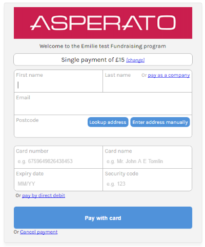

# Payment template

The standard payment template is provided by Asperato and will look similar to the following:

## Template features

Out of the box, the template is highly dynamic and responds to a number of different parameters that can be set either from Salesforce or from the URL:

 - Amount
 - Frequency (including one off payments)
 - Payment types (including combinations of payment types, such as Card & Direct Debit, Paypal & Direct Debit, Card, Paypal & eCheck, etc.)
 - Address data (can be pre-populated)
 - URL to navigate to on completion of the payment
 
The template also has the following dynamic elements built in:
 
  - Notification if the Salesforce webservice cannot be contacted
  - UK postcode checker & lookup
  - Display of card type based on card number
  - Validation of card number using Luhn algorithm
  - Display of issue number & start date fields only if the card requires it
  - Validation of security code as 3 or 4 digits depending on the card type
  - Ability to switch between Card, Direct debit, eCheck or Paypal on the fly
  - Ability to enter IBAN or distinct local bank details for all BACS / SEPA European Direct Debit countries
  - Automatic hiding / showing and labelling of local bank detail fields based on selected country
  - Compliant to BACS and SEPA scheme rules, correct compliance labelling is determined by scheme rules in the selected country
  
The template is fully responsive, works on all the latest versions of major browsers, and is routinely updated by Asperato to work with new card ranges and payment types.

##Passing parameters

Parameters may be passed to the payment page via URL parameters, as well as from Salesforce. Passing parameters in the URL is often useful for testing purposes.

The parameters are simply added to the end of the URL in the normal `GET` format. For the parameter names, please see the "Field names" section below.

As an example, if the normal URL to the payment page is:

https://test.protectedpayments.net/Asperato/asp/PMWeb1?pmRef=73&campaignRef=431

Then the email can be pre-populated to "test@asperato.com", and the amount to £12 with the following URL:

https://test.protectedpayments.net/Asperato/asp/PMWeb1?pmRef=73&campaignRef=431&DLemail=test@asperato.com&DLamount=12

##Using the template in an iframe

Many customers wish to use the template in an iframe as part of their existing site, rather than displaying it as a standalone page - this is supported by Asperato, as long as the containing site is served over TLS1.2 or newer. Please make sure your iframe element is large enough to contain the payment form without any scrollbars. We recommend a size of at least 500px width and 1000px height.

Non-secure pages may not iframe the Asperato payment page in this way, as customers have no easy way of determining that the iframe itself is securing if the surrounding page is not.

##Field names

These field names can be passed to the URL of the payment page to pre-populate details.

###DLamount

The amount to charge. One of DLamount or DLauthAmount must be provided, depending on whether this is a payment template or an authorisation template.

###DLemail

The email address of the customer.

###DLforename

The first name.

###DLlastname

The last name.

###DLaddress1

The first line of the address.

###DLaddress2

The second line of the address.

###DLcity

The town or city of the address.

###DLcounty

The county or state of the address.

###DLcountry

The country of the address.

###DLpostcode

The postcode, or zip code of the address.

##Entirely custom payment page

It is possible, but not recommended, to design a custom payment page from scratch with the above functionality. In our experience this rarely works well due to the number of corner cases that must be covered. If you choose this route for your payment pages, it will incur an additional charge and will not be supported by Asperato.
